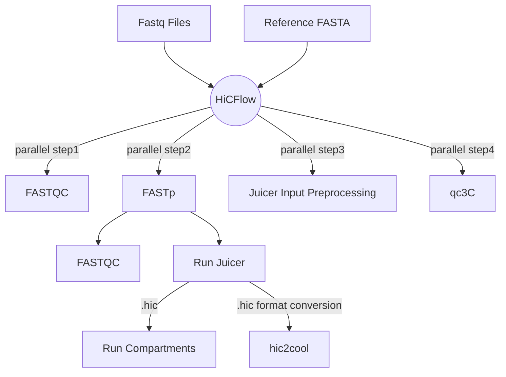

[](https://www.nextflow.io/)
[](https://docs.conda.io/en/latest/)

HiCFlow is a hassle-free nextflow pipeline for HIC Data analysis 
> This pipeline is still under development and requires optimization. Please open an issue should you encounter error or unexpected results.

## Setting up environment

HiCFlow is easy to setup. Follow the instructions below
```bash
## Instal mamba for quick pipeline dependency setup
conda install mamba -n base -c conda-forge
mamba env create -f environment.yml
mamba activate hic
```
**Note:** Users are encouraged to download the `Juicer v1.6` separately from [here](https://github.com/aidenlab/juicer/releases) since the main branch contains `v2` which has bugs. The Juicer should be cloned in `tools` directory as per instructions given by Juicer manual [here ](https://github.com/aidenlab/juicer/wiki/Installation) (See **Example with CPU version**)

## Directory Structure
The only directories you have to worry about are the following:
```bash
data/
tools/
references/
```

 - Dump all your fastq files in the `data` directory.
 - `tools` directory will hold your juicer executables.
 - `references` directory will hold your reference FASTA file and BWA indexes which are easy to generate using `bwa index ref.fa` commands. 
 
## Running the pipeline

Open the help section to view mandatory arguments and optional arguments by using the command below:
```bash
nextflow run main.nf --help
```
The help section enlist the input required by `HiCFlow` pipeline.
```bash

N E X T F L O W  ~  version 23.10.1
Launching `main.nf` [disturbed_sax] DSL2 - revision: 8a368e089a

 * -------------------------------------------------
 *  HiCFlow@KAUST: Analyzing Hi-C Dataset
 * -------------------------------------------------
Usage:
	nextflow run main.nf --input "fastq/*R{1,2}_001.fastq.gz" --outdir results --ref /data/coursework2024/exam/references/hg38.p13.fa 	 --mode PE --enzyme MboI  --prefix hg38 --insertSize 300	--index_dir 
Input:
	#### Mandatory Arguments ####
	* --enzyme: Name of restriction digestion enzyme used. Default [MboI]
	* --index_dir: Provide path to director where BWA indexes are stored. Default []
	* --input: Path to FastqQ files. Default [fastq/*R{1,2}_001.fastq.gz]
	* --mode: If data is Paired-end pass "PE" else "SE". Default [PE]
	* --outdir: Path/Name of the output directory. Default [results]
	* --ref: Path to reference fasta file. Default [/data/coursework2024/exam/references/hg38.p13.fa]
	* --prefix: Prefix used by the indexed files. Default [hg38]
 	* --insertSize: Insert size. Default [300]
	* --compartments: Size of the compartments. Default [100000]

	#### Parameters to pass additional Arguments ####
	* --fastp_ext: Additional arguments to pass to FASTP. Default [--detect_adapter_for_pe --qualified_quality_phred 30 --length_required 75 --correction --adapter_fasta /data/coursework2024/HiCFlow/references/adapters/TruSeq3-PE.fa]
	* --fastqc_ext: Additional arguments to pass to FASTQC. Default [--quite]

	#### Parameters to Skip certain Steps ####
	* --skipTrim: Set this "true" to skip Trimming Step. Default [false]
	* --skipAlignment: Set this "true" to skip Alignment Step. Default [false]

```
## Use Case
The single-liner command to run HiCFlow is as follows
```bash
nextflow run main.nf --input "data/*_{1,2}.fastq.gz" \ ##regular expression of the FASTQ files
--outdir plasmodium_results \ ## name of output directory
--ref $PWD/references/PlasmoDB-67_Pfalciparum3D7_Genome.fasta \ ## reference fasta
--mode PE --enzyme MboI --prefix PlasmoDB-67_Pfalciparum \ ## restriction enzyme and prefix of BWA indexes
--insertSize 300 --index_dir $PWD/references/ # insert size and index Directory 
```
You can add `-resume` argument to the command above if the pipeline gets interrupted in the middle or throws an error to prevent rerunning of steps that were successfully ran.

## Pipeline summary

1.  Run FASTQC ([`FastQC`](https://www.bioinformatics.babraham.ac.uk/projects/fastqc/))
2. Run FASTP for adapter trimming([`fastp`](https://github.com/OpenGene/fastp))
3.  Reference-free quality control for Hi-C ([`qc3C`](https://github.com/cerebis/qc3C))
4. Quality control report ([`MultiQC`](https://multiqc.info/))
5.  Create restriction sites file for restriction enzyme ([`prepareJuicer`](https://github.com/Rohit-Satyam/HiCFlow/blob/main/modules/03_prepareJuicer.nf))
6. HiC data processing ([`Juicer`](https://github.com/aidenlab/juicer)).
    1. Reads Mapping using BWA and Chimeric Read handling  ([`bwa`](https://github.com/lh3/bwa))
    2.  Detection of duplicates and removal
    3.  Generate raw and normalized contact maps ([`KR`](https://github.com/hiclib/iced))
8.  Convert `.hic` files to `.cool` file ([`hic2cool`](https://github.com/4dn-dcic/hic2cool))

 
HiCFlow tries to run the following processes (some parallely and some sequentially). The parallel steps are demarcated in white rectangles. 


## Output Directory Structure
The `HiCFlow` produces 4 directories as shown below
```bash
plasmodium_results/
├── 01_QC3C
│   ├── SRR19611535
│   │   ├── qc3c_kmers.jf
│   │   ├── qc3C.log
│   │   ├── report.qc3C.html
│   │   └── report.qc3C.json
│   │   └── report.qc3C.json
├── 01_rawFastQC
│   ├── pre-trimming_data
│   │   ├── multiqc_citations.txt
│   │   ├── multiqc_data.json
│   │   ├── multiqc_fastqc.txt
│   │   ├── multiqc_general_stats.txt
│   │   ├── multiqc.log
│   │   ├── multiqc_software_versions.txt
│   │   └── multiqc_sources.txt
│   ├── pre-trimming.html
│   ├── SRR19611534_1_fastqc.html
│   ├── SRR19611534_1_fastqc.zip
│   ├── SRR19611534_2_fastqc.html
│   ├── SRR19611534_2_fastqc.zip
├── 02_adapterTrimming
│   ├── postTrimFASTQC
│   │   ├── SRR19611534_trim_R1_fastqc.html
│   │   ├── SRR19611534_trim_R1_fastqc.zip
│   │   ├── SRR19611534_trim_R2_fastqc.html
│   │   ├── SRR19611534_trim_R2_fastqc.zip
│   ├── post-trimming_data
│   │   ├── multiqc_citations.txt
│   │   ├── multiqc_data.json
│   │   ├── multiqc_fastqc.txt
│   │   ├── multiqc_general_stats.txt
│   │   ├── multiqc.log
│   │   ├── multiqc_software_versions.txt
│   │   └── multiqc_sources.txt
│   ├── post-trimming.html
│   ├── SRR19611534.fastp.html
│   ├── SRR19611534.fastp.json
│   ├── SRR19611534_fastp.txt
│   ├── SRR19611534.log
│   ├── SRR19611534_trim_R1.fastq.gz
│   ├── SRR19611534_trim_R2.fastq.gz
├── 03_JuicerPrepare
│   ├── PlasmoDB-67_Pfalciparum.chrom.sizes
│   └── PlasmoDB-67_Pfalciparum_MboI.txt
├── 04_juicerResults
│   ├── outputSCC.txt
│   ├── SRR19611534
│   │   ├── abnormal.sam
│   │   ├── collisions_nodups.txt
│   │   ├── collisions.txt
│   │   ├── dups.txt
│   │   ├── header
│   │   ├── inter_30_contact_domains
│   │   │   └── 5000_blocks.bedpe
│   │   ├── inter_30.hic
│   │   ├── inter_30_hists.m
│   │   ├── inter_30.mcool
│   │   ├── inter_30.txt
│   │   ├── inter.hic
│   │   ├── inter_hists.m
│   │   ├── inter.mcool
│   │   ├── inter.txt
│   │   ├── merged_nodups.txt
│   │   ├── merged_sort.txt
│   │   ├── opt_dups.txt
│   │   ├── Pf3D7_01_v3_eigen.txt
│   │   ├── Pf3D7_02_v3_eigen.txt
│   │   ├── Pf3D7_03_v3_eigen.txt
│   │   ├── Pf3D7_04_v3_eigen.txt
│   │   ├── Pf3D7_05_v3_eigen.txt
│   │   ├── Pf3D7_06_v3_eigen.txt
│   │   ├── Pf3D7_07_v3_eigen.txt
│   │   ├── Pf3D7_08_v3_eigen.txt
│   │   ├── Pf3D7_09_v3_eigen.txt
│   │   ├── Pf3D7_10_v3_eigen.txt
│   │   ├── Pf3D7_11_v3_eigen.txt
│   │   ├── Pf3D7_12_v3_eigen.txt
│   │   ├── Pf3D7_13_v3_eigen.txt
│   │   ├── Pf3D7_14_v3_eigen.txt
│   │   ├── Pf3D7_API_v3_eigen.txt
│   │   ├── Pf3D7_MIT_v3_eigen.txt
│   │   └── unmapped.sam
├── execution_trace.txt
├── pipeline_dag.html
├── report.html
└── timeline.html
```
