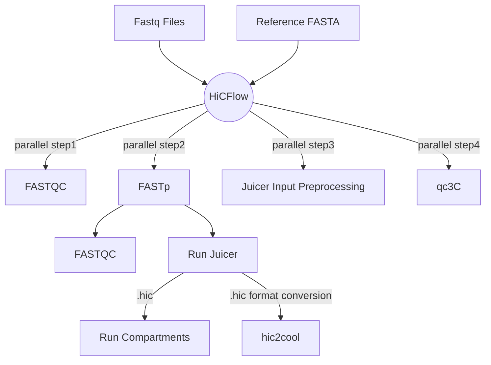

HiCFlow is a hassle-free nextflow pipeline for HIC Data analysis 


## Setting up environment

```bash
## Instal mamba for quick pipeline dependency setup
conda install mamba -n base -c conda-forge
mamba env create -f environment.yml
mamba activate hic
```
Note: Users are encouraged to download the `Juicer v1.6` separately from [here](https://github.com/aidenlab/juicer/releases) since the main branch contains `v2` which has bugs. The Juicer should be cloned in `tools` directory as per instructions given by Juicer manual [here ](https://github.com/aidenlab/juicer/wiki/Installation) (See **Example with CPU version**)

## Directory Structure
The only directories you have to worry about are the following:
```bash
data/
tools/
references/
```

 - Dump all your fastq files in the `data` directory.
 - `tools` directory will hold your juicer executables.
 - `references` directory will hold your reference FASTA file and BWA indexes which are easy to generate using `bwa index ref.fa` commands. 
 
## Running the pipeline

Open the help section to view mandatory arguments and optional arguments by using the command below:
```bash
nextflow run main.nf --help
```
The help section enlist the input required by `HiCFlow` pipeline.
```bash

N E X T F L O W  ~  version 23.10.1
Launching `main.nf` [disturbed_sax] DSL2 - revision: 8a368e089a

 * -------------------------------------------------
 *  HiCFlow@KAUST: Analyzing Hi-C Dataset
 * -------------------------------------------------
Usage:
	nextflow run main.nf --input "fastq/*R{1,2}_001.fastq.gz" --outdir results --ref /data/coursework2024/exam/references/hg38.p13.fa 	 --mode PE --enzyme MboI  --prefix hg38 --insertSize 300	--index_dir 
Input:
	#### Mandatory Arguments ####
	* --enzyme: Name of restriction digestion enzyme used. Default [MboI]
	* --index_dir: Provide path to director where BWA indexes are stored. Default []
	* --input: Path to FastqQ files. Default [fastq/*R{1,2}_001.fastq.gz]
	* --mode: If data is Paired-end pass "PE" else "SE". Default [PE]
	* --outdir: Path/Name of the output directory. Default [results]
	* --ref: Path to reference fasta file. Default [/data/coursework2024/exam/references/hg38.p13.fa]
	* --prefix: Prefix used by the indexed files. Default [hg38]
 	* --insertSize: Insert size. Default [300]
	* --compartments: Size of the compartments. Default [100000]

	#### Parameters to pass additional Arguments ####
	* --fastp_ext: Additional arguments to pass to FASTP. Default [--detect_adapter_for_pe --qualified_quality_phred 30 --length_required 75 --correction --adapter_fasta /data/coursework2024/HiCFlow/references/adapters/TruSeq3-PE.fa]
	* --fastqc_ext: Additional arguments to pass to FASTQC. Default [--quite]

	#### Parameters to Skip certain Steps ####
	* --skipTrim: Set this "true" to skip Trimming Step. Default [false]
	* --skipAlignment: Set this "true" to skip Alignment Step. Default [false]

```
## Use Case
The single-liner command to run HiCFlow is as follows
```bash
nextflow run main.nf --input "data/*_{1,2}.fastq.gz" \ ##regular expression of the FASTQ files
--outdir plasmodium_results \ ## name of output directory
--ref $PWD/references/PlasmoDB-67_Pfalciparum3D7_Genome.fasta \ ## reference fasta
--mode PE --enzyme MboI --prefix PlasmoDB-67_Pfalciparum \ ## restriction enzyme and prefix of BWA indexes
--insertSize 300 --index_dir $PWD/references/ # insert size and index Directory 
```
You can add `-resume` argument to the command above if the pipeline gets interrupted in the middle or throws an error to prevent rerunning of steps that were successfully ran.

## HiCFlow workflow
HiCFlow tries to run the following processes (some parallely and some sequentially). The parallel steps are demarcated in white rectangles. 

